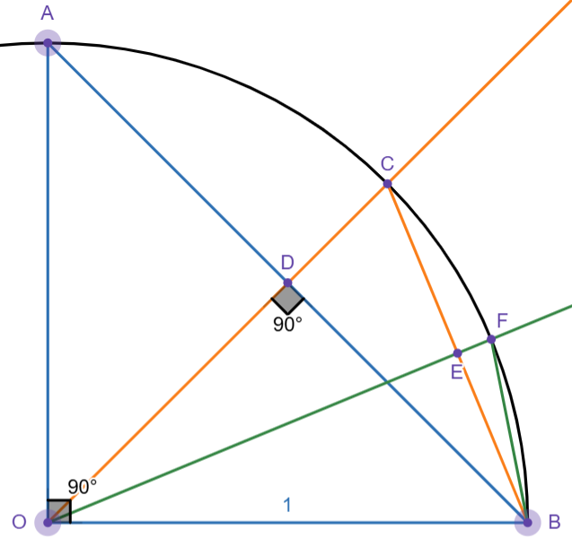
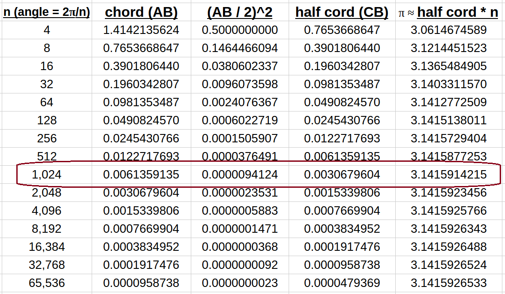
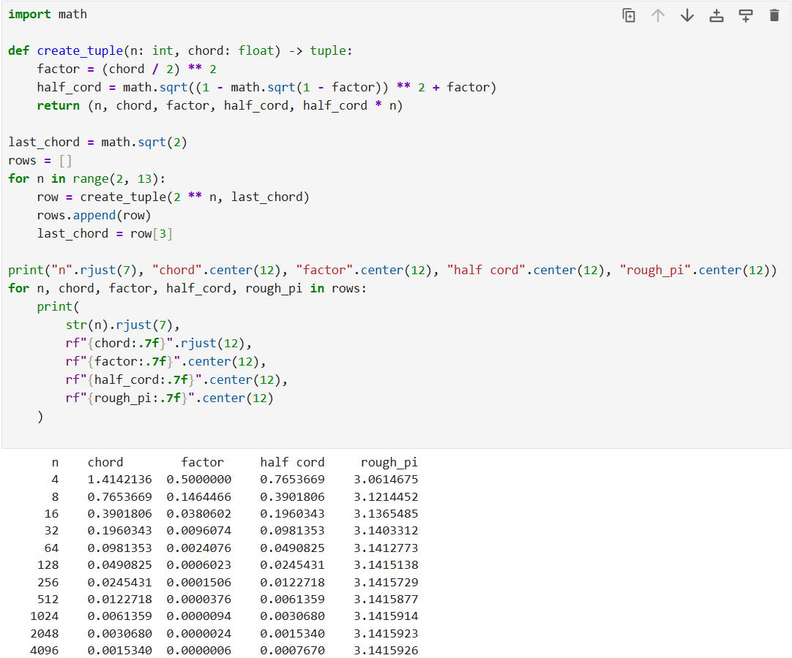

# Seeking $\pi$
By Ben 2025-03-16

## Introduction
Turns out with modern technology it is not that difficult to find the approximate value of $\pi$ iteratively. With an Excel file or a Python code below, everyone can do it. Here's how.

## Concept

In the above diagram, $\angle AOB$ is 90&deg; (or $\frac{\pi}{4})$, and it is easy to know the length of chord $\overline{AB}$ to be $\sqrt{1^2 + 1^2} = \sqrt{2}$. However, knowing that alone would not go too far to seek $\pi$.

Know that 4 chord $\overline{AB}$ go around the unit circle, hence we have $n \overline{AB} \approx 2 \pi$ (very roughly) where $n = 4$.

Given $\overline{AB}$, if we bisect it to get $C$ on the arc, we have:

$$
n \overline{CB} \approx 2 \pi \text{, where } n=8
$$

That gives a better approximation to $\pi$. Given $\overline{CB}$, if we further bisect it to get $F$, we have:

$$
n \overline{FB} \approx 2 \pi \text{, where } n = 16
$$

Hence, the approximation of $\pi$ improves over iterations of this process above (hopefully with an Excel file or a Python script).

> Given chord $\overline{AB}$, what is the length of chord $\overline{CB}$?
> 
> Then iteratively, given chord $\overline{CB}$, what is chord $\overline{FB}$?
> 
> ...

## Calculations
If we focus on the blue-orange lines, by Pythagoras theorem:

$$
\begin{aligned}
\overline{CB}^2 = \overline{CD}^2 + \overline{DB}^2 \\
= (1-\overline{OD})^2 + \overline{DB}^2 (\because \overline{CD} = 1 - \overline{OD}) \\
= \bigg( 1-\sqrt{1-\overline{DB}^2} \bigg) ^2 + \overline{DB}^2 (\because \overline{OD}^2 + \overline{DB}^2 = 1) \\
= \bigg( 1-\sqrt{1-\bigg( \frac{\overline{AB}}{2} \bigg) ^2} \bigg) ^2 + \bigg( \frac{\overline{AB}}{2} \bigg) ^2 (\because \overline{DB} = \frac{\overline{AB}}{2})
\end{aligned}
$$

In other words,

$$
\overline{CB} = \sqrt{ \bigg( 1-\sqrt{1-\bigg( \frac{\overline{AB}}{2} \bigg) ^2} \bigg) ^2 + \bigg( \frac{\overline{AB}}{2} \bigg) ^2 }
$$

and don't forget that $8\overline{CB} \approx 2\pi$.

We successfully express $\overline{CB}$ in terns of $\overline{AB}$. This is iteration #1.

If we shift the focus to the orange-green lines, know that we already know $\overline{CB}$, we can use the same equation to calculate $\overline{FB}$. We have:

$$
\overline{FB}
= \sqrt{ \bigg( 1-\sqrt{1-\bigg( \frac{\overline{CB}}{2} \bigg) ^2} \bigg) ^2 + \bigg( \frac{\overline{CB}}{2} \bigg) ^2 }
$$

and $16\overline{FB} \approx 2\pi$

Note that each iteration would double the value of $n$. By repeating these steps for more iterations we will progressively get better approximations of $\pi$.

## Using Excel to iterate
We first use an Excel file to implement that. Let's start with $n=4$ and chord $\overline{AB} = \sqrt{2}$. Also, observe that $\big( \frac{\overline{AB}}{2} \big)^2$ is a value used repeatedly, we need this as an auxiliary column:

Note that by a half chord of the angle $\frac{2\pi}{1024}$ the value of $\pi$ is already pretty accurate.

## Using Python
We can also use a simple Python script to achieve that. For illustrtion purpose here is a screen capture from Python Notebook. The result is satisfactory:

You can find this source code at my GitHub page at <a href="https://github.com/creambun/seeking-pi/blob/master/iterations.py">https://github.com/creambun/seeking-pi/blob/master/iterations.py</a>
